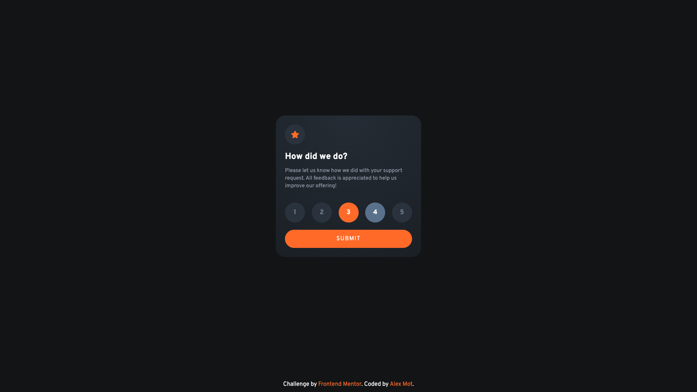
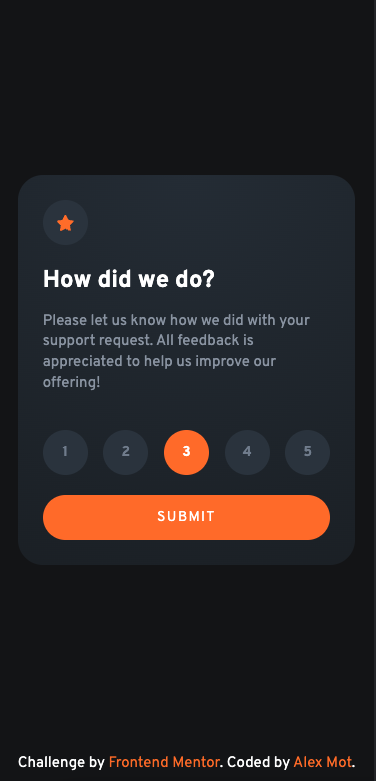

# Frontend Mentor - Interactive rating component solution

This is a solution to the [Interactive rating component challenge on Frontend Mentor](https://www.frontendmentor.io/challenges/interactive-rating-component-koxpeBUmI). Frontend Mentor challenges help you improve your coding skills by building realistic projects. 

## Table of contents

- [Frontend Mentor - Interactive rating component solution](#frontend-mentor---interactive-rating-component-solution)
  - [Table of contents](#table-of-contents)
  - [Overview](#overview)
    - [The challenge](#the-challenge)
    - [Screenshots](#screenshots)
    - [Links](#links)
  - [My process](#my-process)
    - [Built with](#built-with)
    - [What I learned](#what-i-learned)
    - [Continued development](#continued-development)
    - [Useful resources](#useful-resources)
  - [Author](#author)
  - [Acknowledgments](#acknowledgments)

## Overview

### The challenge

Users should be able to:

- View the optimal layout for the app depending on their device's screen size
- See hover states for all interactive elements on the page
- Select and submit a number rating
- See the "Thank you" card state after submitting a rating

### Screenshots




### Links

- [Solution URL](https://www.frontendmentor.io/solutions/interactive-rating-component-r185VRjcNA)
- [Live Site URL](https://interactive-rating-component-ten-black.vercel.app/)

## My process

### Built with

- Semantic HTML5 markup
- Sass
- Flexbox
- Vanilla Javascript

### What I learned

There are a ton of things I learned during this challenge that I can't fit in this section, so here are 2 important ones.

Firstly, I learned Flexbox and that it's super useful to position stuff around: 
```css
main {
  display: flex;
  justify-content: center;
  align-items: center;
}
```

Then I learned about how to set radio inputs for this project:
```html
<input type="radio" id="choice1" name="rating-choices" value="1">
<label for="choice1" class="circle-border">1</label>
```
```javascript
const ratingChoice = document.querySelector('input[name="rating-choices"]:checked');
```

### Continued development

I'll be focusing more on mobile-first workflow in my next projects.

### Useful resources

- [MDN input type="radio"](https://developer.mozilla.org/en-US/docs/Web/HTML/Element/input/radio) - This helped me with the rating section.
- [A Complete Guide to Flexbox](https://css-tricks.com/snippets/css/a-guide-to-flexbox/) - This is an amazing article about Flexbox and how it work. I totally recommend it!

## Author

- Frontend Mentor - [@alexandrumot](https://www.frontendmentor.io/profile/alexandrumot)

## Acknowledgments

Thanks to [Mako's](https://www.frontendmentor.io/profile/m4koo) solution I realised that my approach regarding the rating buttons wasn't as good as could've been.

