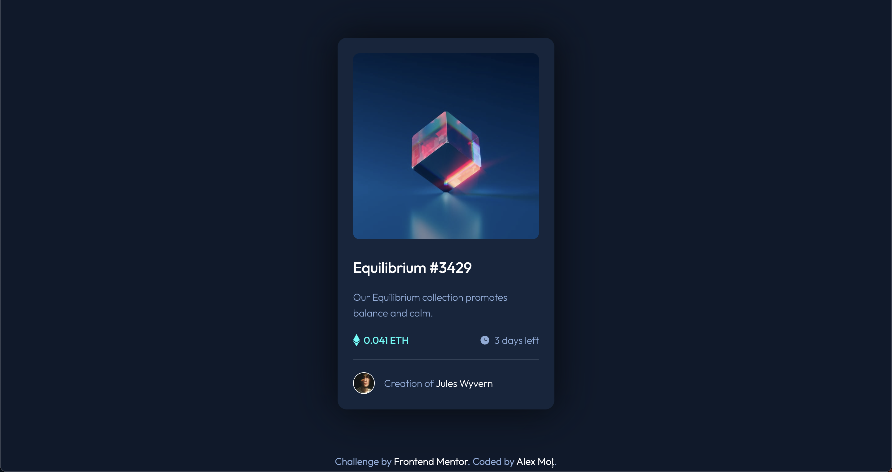
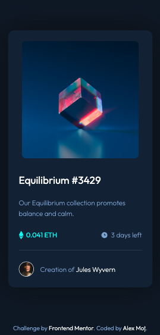

# Frontend Mentor - NFT preview card component solution

This is a solution to the [NFT preview card component challenge on Frontend Mentor](https://www.frontendmentor.io/challenges/nft-preview-card-component-SbdUL_w0U). Frontend Mentor challenges help you improve your coding skills by building realistic projects. 

## Table of contents

- [Frontend Mentor - NFT preview card component solution](#frontend-mentor---nft-preview-card-component-solution)
  - [Table of contents](#table-of-contents)
  - [Overview](#overview)
    - [The challenge](#the-challenge)
    - [Screenshot](#screenshot)
    - [Links](#links)
  - [My process](#my-process)
    - [Built with](#built-with)
    - [What I learned](#what-i-learned)
    - [Continued development](#continued-development)
    - [Useful resources](#useful-resources)
  - [Author](#author)

## Overview

### The challenge

Users should be able to:

- View the optimal layout depending on their device's screen size
- See hover states for interactive elements

### Screenshot




### Links

- [Solution URL](https://your-solution-url.com)
- [Live Site URL](https://frontendmentor-challenges-delta.vercel.app/nft-preview-card-component/index.html)

## My process

### Built with

- Semantic HTML5 markup
- CSS custom properties
- Flexbox
- Animations

### What I learned

In this challenge I learned how to use animations:


```css
@keyframes fadein {
  from { opacity: 0; }
  to { opacity: 1; }
}
```

### Continued development

I will continue using animations in my future projects.

### Useful resources

- [W3Schools CSS Animations](https://www.w3schools.com/css/css3_animations.asp) - One of the best resources for CSS animations.

## Author

- [Website](https://frontendmentor-challenges-delta.vercel.app/)
- [Frontend Mentor](https://www.frontendmentor.io/profile/alexandrumot)